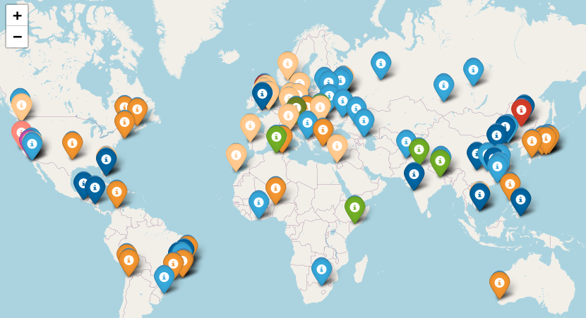
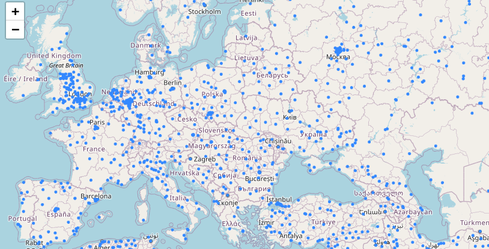

# complex-social-systems-lab
The tutorials and labs from my Complex Social Systems course at the university

### The clustered cities
-  The clustered cities with population over 100k and less than 110k are shown in the following figure.
The cities are clustered based on their network statistics.
The markers are colored based on the cluster they belong to.
The cities in the same cluster have the same color. Overall there
are 91 cities distributed in 10 clusters.

- The entire dataset consists of all the cities in the world with population over 1000.
Here is a snapshot of the dataset for European cities.

